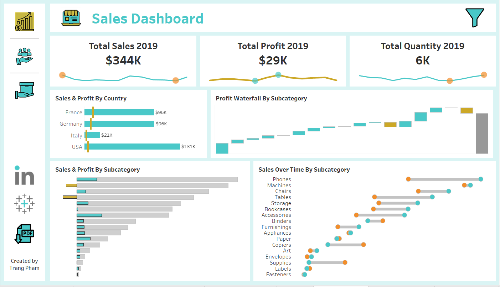
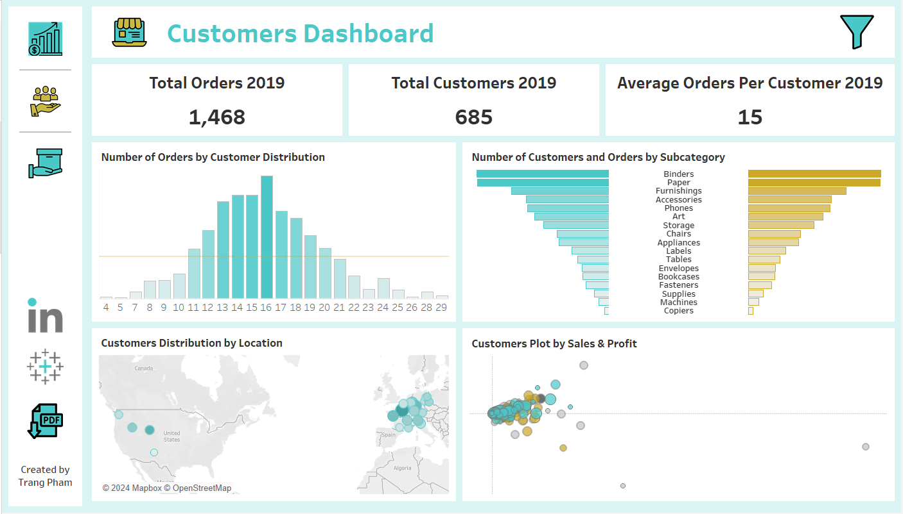
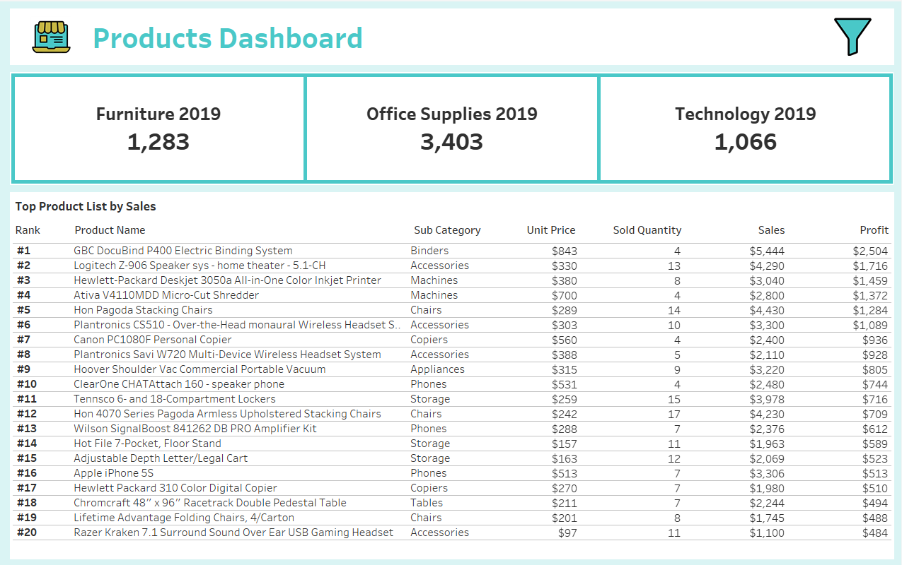

# Data Porfolio: Sales Analysis using MySQL & Tableau.

This is an Data Exproration Analysis on sales dataset created by Baraa Khatib Salkini. Tableau visualization is also inspired by his Tableau Dashboard. 

📊📊📊

# Table of content

- [Objective](#Objective)
- [Data source](#Data-source)
- [Data exploration in MySQL](#Data-exploration-in-MySQL)
    - [Data cleaning](#Data-cleaning)
    - [Data exploration](#Data-exploration)
        - [Sales and Profit by Country](#Sales-and-Profit-by-Country)
        - [Sales and Profit by Category](#Sales-and-Profit-by-Category) 
        - [Non-profitable products](#Non-profitable-products)
        - [Orders with highest sales during 2022](#Orders-with-highest-sales-during-2022)
        - [Top selling products in each category](#Top-selling-products-in-each-category)
        - [Distribution of customers by country](#Distribution-of-customers-by-country)
        - [Distribution of customers by score](#Distribution-of-customers-by-score)
- [Data visualization in Tableau](#Data-visualization-in-Tableau)
- [Insight](#Insight)

# Objective

After cleaning and prepare the sales data for further analysis, I want to understand data using MySQL, to visualize the sales trend and easy insights about all factors affecting the sales and profit using Tableau. 

The ultimate purpose is to suggest effective ways to improve actual profit.   

# Data source

The data source is generated by Baraa Khatib Salkini. 
https://www.datawithbaraa.com/tableau/tableau-thank-you/

# Data exploration in MySQL

## Data cleaning

```sql
/*
Importing excel file to Workbench, however, the Order_Date and Shipping_Date are not correctly imported as date type.
 
1. Add column order_date_modified
2. Change Order_date from String type to Date type and add to new Order_date_modified column
3. Drop column order_date, change the name of new order_date_modified to replace the original order_date.

*/

-- 1.

alter table sales_non_eu.orders
add column order_date_modified date;

-- 2. 

UPDATE sales_non_eu.orders 
SET 
    order_date_modified = str_to_date(CONCAT(SUBSTRING(Order_Date, 1, 2),'/',
                    SUBSTRING(Order_Date, 4, 2),'/',
                    SUBSTRING(Order_Date, 7, 4)),
            '%d/%m/%Y')
WHERE
    order_ID <> 0

-- 3.

alter table sales_non_eu.orders
drop column Order_Date;

alter table sales_non_eu.orders
change column order_date_modified Order_Date date;

/*
Do similarly for Shipping_date column

1. Add Shipping_date_modified column
2. Convert String to Date type, and add the data to new shipping_date_modified column
3. Drop column shipping_date, change the name of new shipping_date_modified to replace the original shippping_date column
*/

-- 1.

alter table sales_non_eu.orders
add column Shipping_Date_modified date; 

-- 2.

UPDATE sales_non_eu.orders 
SET 
    Shipping_Date_modified = STR_TO_DATE(CONCAT(SUBSTRING(Shipping_Date, 1, 2),
                    '/',
                    SUBSTRING(Shipping_Date, 4, 2),
                    '/',
                    SUBSTRING(Shipping_Date, 7, 4)),
            '%d/%m/%Y')
WHERE
    Order_ID <> 0;

-- 3. 

alter table sales_non_eu.orders
drop column Shipping_Date;

alter table sales_non_eu.orders
change column Shipping_Date_modified Shipping_Date date;

;
```

## Data exploration

### Sales and Profit by Country

```sql

-- 1. Sales and Profit by Country

SELECT 
    c.Country,
    round(SUM(o.Sales), 2) AS total_sales,
    round(SUM(o.Profit),2) AS total_profit,
    concat(format(sum(o.Profit)/sum(o.Sales)*100,0),'%') as profit_margin_percentage
FROM
    sales_non_eu.orders o
        JOIN
    sales_non_eu.customers c ON o.Customer_ID = c.Customer_ID
GROUP BY Country
ORDER BY total_profit DESC
;

```

|Country|total_sales|total_profit|profit_margin_percentage|
|---    |---        |---         |---                     |
|Germany|  829066.72|	100477.25|                     12%|
|USA    |  904327.95|	    93866|                     10%|
|France |  918969.28|	 87871.23|                     10%|
|Italy  |  192105.24|	 20852.22|                     11%|

⇛ France is the market that generate highest sales, however Germany is the most profitable market, which generate the highest profit rate at 12%. Italy has smallest sales however ranked in 2nd in profit margin. 

### Sales and Profit by Category

```sql
SELECT 
    p.Category,
    ROUND(SUM(o.Sales), 2) AS total_sales,
    ROUND(SUM(o.Profit), 2) AS total_profit,
    concat(round(sum(o.Profit)/sum(o.Sales)*100),'%') as profit_margin
FROM
    sales_non_eu.orders o
        JOIN
    sales_non_eu.products p ON o.Product_ID = p.Product_ID
        JOIN
    sales_non_eu.customers c ON o.Customer_ID = c.Customer_ID
GROUP BY 1 
ORDER BY total_sales desc
;
```

|Category        | total_sales| sales_percentage |total_profit|profit_percentage  | profit_margin|
|---             |---         |---               |---         |---                |---           |
|Furniture       |	104222.25 |	54.69%           |	3515.62   |	17.14%            |	3%           |
|Office Supplies |	52840.15  |	27.73%           |	11446.79  |	55.82%            |	22%          |
|Technology      |	33519.78  |	17.59%           |	5545.85   |	27.04%            |	17%          |

⇛ Highest sales is the funiture category, generating 54.69% of total sales. However, office supplies generate highest profit at 55.82% of total profit. Profit margin of funiture is only 3% while of office supplies is 22%. Tenology has the 2nd highest profit margin. 


### Non-profitable products

```sql
SELECT 
    p.Category,
    p.Sub_Category,
    c.country,
    ROUND(SUM(o.Sales), 2) AS total_sales,
    ROUND(SUM(o.Profit), 2) AS total_profit
FROM
    sales_non_eu.orders o
        JOIN
    sales_non_eu.products p ON o.Product_ID = p.Product_ID
        JOIN
    sales_non_eu.customers c ON c.Customer_ID = o.Customer_ID
GROUP BY 1 , 2 , 3
HAVING total_profit < 0
ORDER BY total_profit ASC;
```

|Category   | Sub_Category| country | total_sales| total_profit  |
|-----------|-------------|---------|------------|---------------|
|Furniture	|Tables	      |USA	    |8092.9	     |-867.24        |
|Furniture	|Tables	      |France	|2629.48	 |-855.91        |
|Furniture	|Tables	      |Germany	|4759.56	 |-774.69        |
|Furniture	|Bookcases	  |USA	    |5879.05	 |-286.2         |
|Furniture	|Tables	      |Italy	|2750.81	 |-210.67        |

⇛ Table subcategory has generated no profit at all, even though it still generate high sales in all countries. In US, bookcases are also in the same position.

### Orders with highest sales during 2022

```sql
SELECT 
    o.Order_ID,
    o.Sales,
    o.Quantity,
    o.Discount,
    o.Profit,
    o.Order_Date,
    o.Shipping_Date,
    o.Product_ID,
    p.Product_Name,
    p.Category,
    p.Sub_Category,
    c.Country,
    c.City,
    c.Score
FROM
    sales_non_eu.orders o
        JOIN
    sales_non_eu.products p ON o.Product_ID = p.Product_ID
        JOIN
    sales_non_eu.customers c ON o.Customer_ID = c.Customer_ID
GROUP BY 1 , 2
HAVING order_date between '2022-01-01' and '2023-01-01'
ORDER BY o.sales DESC
LIMIT 5
;
```

|Order_ID|Sales	    |Quantity	|Discount	|Profit	    |Order_Date	|Shipping_Date	|Product_ID	|Product_Name	                                                |Category	|Sub_Category	|Country	|City	 |Score |
|-------|-----------|-----------|-----------|-----------|-----------|---------------|-----------|---------------------------------------------------------------|-----------|---------------|-----------|--------|------|
|7615	|4404.9	    |5	        |0	        |1013.127	|2022-06-08	|2022-06-11	    |27	        |Riverside Palais Royal Lawyers Bookcase, Royale Cherry Finish	|Furniture	|Bookcases	    |Germany	|Köln	 |17    |
|8270	|4228.704	|6	        |0.2	    |158.5764	|2022-03-18	|2022-04-13	    |27         |Riverside Palais Royal Lawyers Bookcase, Royale Cherry Finish	|Furniture	|Bookcases	    |Italy	    |Torino	 |43    |
|9127	|4228.704	|6	        |0.2	    |158.5764	|2022-09-03	|2022-09-26	    |27	        |Riverside Palais Royal Lawyers Bookcase, Royale Cherry Finish	|Furniture	|Bookcases	    |France	    |Reims	 |23    |
|9775	|4228.704	|6	        |0.2	    |158.5764	|2022-11-24	|2022-12-03	    |27	        |Riverside Palais Royal Lawyers Bookcase, Royale Cherry Finish	|Furniture	|Bookcases	    |Italy	    |Bergamo |52    |
|8515	|2396.2656	|4	        |0.32	    |-317.1528	|2022-08-05	|2022-08-18	    |27	        |Riverside Palais Royal Lawyers Bookcase, Royale Cherry Finish	|Furniture	|Bookcases	    |USA	    |Portland|0     |

⇛ Bookcases orders generate high sales, however they don't guarantee profit all the time, for example the case of US order. 

### Top selling products in each category

```sql
with RankedProducts as
(SELECT 
    p.Category,
    p.Product_Name, 
    SUM(o.Quantity) AS sold_quantity,
    RANK() over (partition by p.category order by sum(o.quantity) desc ) as product_rank
    
FROM
    sales_non_eu.orders o
        JOIN
    sales_non_eu.products p ON o.Product_ID = p.Product_ID
        JOIN
    sales_non_eu.customers c ON o.Customer_ID = c.Customer_ID
GROUP BY 1,2
order by sold_quantity desc)
SELECT 
    Category,
    Product_Name,
    sold_quantity
FROM
    RankedProducts
WHERE
    product_rank = 1
;

```


|Category        | Product_Name                         | sold_quantity | 
|----------------|--------------------------------------|---------------|
|Office Supplies |Easy-staple paper	                    |183            |
|Furniture       |9-3/4 Diameter Round Wall Clock	    |84             |
|Technology      |Logitech K350 2.4Ghz Wireless Keyboard|58             |


⇛ These products are best sellers in each categories, with staple paper of the higest sold quantity.

### Distribution of customers by country

```sql
SELECT 
    Country,
    ROUND(AVG(score)) AS Average_score,
    COUNT(*) AS Customer_count,
    ROUND(COUNT(*) / (SELECT 
                    COUNT(*)
                FROM
                    sales_non_eu.customers) * 100) AS Percentage
FROM
    sales_non_eu.customers
GROUP BY Country 
ORDER BY customer_count DESC
;
```


|Country    | Average_score| Customer_count | Customer_count|
|-----------|--------------|----------------|---------------|
|USA	    |42	           |254	            |32             |
|France	    |47	           |246	            |31             |
|Germany	|48	           |241             |30             |
|Italy	    |53	           |59	            |7              |


⇛ Germany, US and France have equal proportion of the total number of customers, while Italy only has 7% of total number of customers. 

### Distribution of customers by score

```sql
SELECT 
    MIN(score), MAX(Score)
FROM
    sales_non_eu.customers;

```

|MIN(score)	|MAX(Score)|
|-----------|----------|
|0	        |100       |

⇛ Min value of score is 0 and max value is 100, so the range can be divided into 5 bins. 

```sql

    
SELECT 
    CASE
        WHEN score < 20 THEN ' under 20'
        WHEN score BETWEEN 20 AND 39 THEN '20-39'
        WHEN score BETWEEN 40 AND 59 THEN '40-59'
        WHEN score BETWEEN 60 AND 79 THEN '60-79'
        ELSE '80 and above'
    END AS score_group,
    COUNT(*) AS customer_count,
    concat(round(count(*)/(select count(*) from sales_non_eu.customers)*100),'%') customers_percentage
FROM
    sales_non_eu.customers
GROUP BY score_group
order by score_group
;
```


|score_group    | customer_count| customers_percentage | 
|---------------|---------------|----------------------|
|under 20       |205            |26%                   |
|20-39	        |150	        |19%                   |
|40-59	        |159	        |20%                   |
|60-79	        |135	        |17%                   |
|80 and above   |151	        |19%                   |

⇛ The largest group of customers has score of under 20. 


# Data visualization in Tableau







Link to the dynamic dashboard in Tableau Public:

https://public.tableau.com/app/profile/trang1217/viz/Sales_Dashboard_17241642306220/ProductsDashboard?publish=yes

# Insight

After reviewing the sales data, it's obvious that Germany, US and France are main markets while Italian market is relatively small in term of sales and profit. Italian market has the potential to increase sales and profit in the future, since it also generate high profit margin. 

Furniture generates highest sales, but is not automatically the most profitable category. On the contrary, furniture is the least profitable, in which table has generated loss in all markets. Table's sales has increased significantly from previous year, which is not great in this case. Increasing table's retail price or reducing this product's proportion in total sales would help to limit table's negative impact on the bottom line. 

We should carefully observing bookcase's sales and profit, which is potentially similar to table's situation. 

